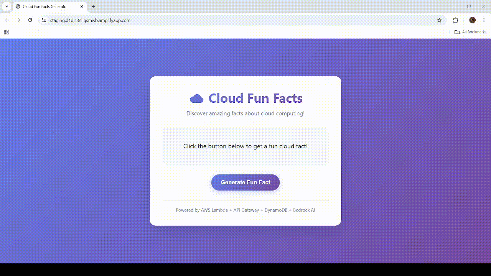

# ☁️ Cloud Fun Facts Generator



A **full-stack serverless application** built on AWS that delivers random, AI-enhanced cloud computing facts through a beautiful web interface. This project demonstrates real-world cloud architecture by connecting multiple AWS services into a cohesive, production-ready application.

---

## 🚀 Live Demo

> Deployed via AWS Amplify — click **"Generate Fun Fact"** to receive a witty, AI-powered cloud fact served from DynamoDB via Lambda and enhanced by Amazon Bedrock (Claude AI).

---

## 🏗️ Architecture Overview

```
User (Browser)
    │
    ▼
AWS Amplify (Frontend Hosting)
    │
    ▼
Amazon API Gateway  ──►  AWS Lambda (Python 3.13)
                              │
                    ┌─────────┴──────────┐
                    ▼                    ▼
             Amazon DynamoDB      Amazon Bedrock
             (CloudFacts table)   (Claude 3.5 Sonnet)
                    │                    │
                    └─────────┬──────────┘
                              ▼
                    Witty AI-enhanced fact
                    returned as JSON response
```

### Flow
1. User accesses the site hosted on **AWS Amplify**
2. User clicks "Generate Fun Fact", triggering an API call to **API Gateway**
3. API Gateway invokes the **Lambda** function
4. Lambda queries **DynamoDB** to retrieve a random cloud fact
5. Lambda sends the fact to **Amazon Bedrock** (Claude AI) for wit enhancement
6. Bedrock returns an engaging, AI-enhanced version of the fact
7. Amplify displays the fun fact to the user

---

## 🛠️ AWS Services Used

| Service | Purpose |
|---|---|
| **AWS Lambda** | Serverless backend — runs Python code to fetch and enhance facts |
| **Amazon API Gateway** | Exposes Lambda as a public REST API endpoint |
| **Amazon DynamoDB** | NoSQL database for storing cloud fun facts |
| **Amazon Bedrock** | Generative AI (Claude 3.5 Sonnet) to make facts witty and engaging |
| **AWS Amplify** | Hosting service for the static HTML/CSS/JS frontend |
| **AWS IAM** | Identity and Access Management for secure service permissions |

---

## ⏱️ Estimated Setup Time & Cost

- **Time:** 90–120 minutes
- **Cost:** ~$0.03
- AWS provides **$200 free credit** for new accounts (valid for 6 months)

---

## 📁 Project Structure

```
cloud-fun-facts-generator/
├── index.html              # Frontend (HTML + CSS + JS — single file)
└── lambda/
    └── lambda_function.py  # Python Lambda handler (DynamoDB + Bedrock)
```

---

## 🔧 Setup & Deployment Guide

### Prerequisites
- An AWS account (free tier eligible)
- Basic familiarity with the AWS Management Console

---

### Stage 1 — Basic Serverless API (Lambda + API Gateway)

#### Step 1: Create a Lambda Function
1. Go to **AWS Management Console** → search for **Lambda**
2. Click **Create function** → **Author from scratch**
3. Set:
   - **Function name:** `CloudFunFacts`
   - **Runtime:** Python 3.13
   - **Permissions:** Create a new role with basic Lambda permissions
4. Click **Create function**

#### Step 2: Add the Lambda Code

```python
import random
import json

def lambda_handler(event, context):
    facts = [
        "AWS S3 was launched in 2006 and still rules cloud storage.",
        "Cloud computing can save companies up to 30% on IT costs.",
        # ... add more facts
    ]
    fact = random.choice(facts)
    return {
        "statusCode": 200,
        "headers": {"Content-Type": "application/json"},
        "body": json.dumps({"fact": fact})
    }
```

Click **Deploy** to save.

#### Step 3: Create API Gateway
1. Go to **API Gateway** → **Create API** → Select **HTTP API**
2. Set **API Name:** `FunfactsAPI`
3. Add integration → select your `CloudFunFacts` Lambda
4. Add a route: **Method:** `GET`, **Path:** `/funfact`
5. Click **Next** → **Create**
6. Go to **Stages** → **default** → copy the **Invoke URL**

---

### Stage 2 — Database Version (DynamoDB + Lambda)

#### Step 1: Create DynamoDB Table
1. Go to **DynamoDB** → **Create table**
   - **Table name:** `CloudFacts`
   - **Partition key:** `FactID` (String)
2. Leave other settings as default → **Create**

#### Step 2: Insert Sample Items
Add entries in JSON view:
```json
{ "FactID": "1", "FactText": "AWS S3 was one of the very first AWS services, launched in 2006." }
{ "FactID": "2", "FactText": "Netflix runs almost all of its infrastructure on AWS." }
```

#### Step 3: Update IAM Role
1. Go to **IAM** → **Roles**
2. Find the role attached to `CloudFunFacts` Lambda
3. Attach policy: **AmazonDynamoDBReadOnlyAccess**

#### Step 4: Update Lambda Code

```python
import boto3
import random
import json

dynamodb = boto3.resource("dynamodb")
table = dynamodb.Table("CloudFacts")

def lambda_handler(event, context):
    response = table.scan()
    items = response.get("Items", [])
    if not items:
        return {"statusCode": 500, "body": json.dumps({"error": "No facts found"})}
    fact = random.choice(items)["FactText"]
    return {
        "statusCode": 200,
        "headers": {"Content-Type": "application/json"},
        "body": json.dumps({"fact": fact})
    }
```

---

### Stage 3 — GenAI Version (Amazon Bedrock)

#### Step 1: Request Bedrock Model Access
1. Go to **Amazon Bedrock Console** → **Model catalog**
2. Search for **Anthropic Claude** → select **Claude 3.5 Sonnet**
3. Click **Modify the model access** → **Next** → **Submit**
4. Wait for status to change from "Access required" → **"Access granted"**

#### Step 2: Update IAM Role
1. Go to **IAM** → **Roles** → open `CloudFunFacts` role
2. Attach policy: **AmazonBedrockFullAccess**

#### Step 3: Update Lambda Code

```python
import boto3
import random
import json

dynamodb = boto3.resource("dynamodb")
table = dynamodb.Table("CloudFacts")
bedrock = boto3.client("bedrock-runtime")

def lambda_handler(event, context):
    response = table.scan()
    items = response.get("Items", [])
    if not items:
        return {
            "statusCode": 200,
            "headers": {
                "Content-Type": "application/json",
                "Access-Control-Allow-Origin": "*",
                "Access-Control-Allow-Methods": "GET, OPTIONS",
                "Access-Control-Allow-Headers": "Content-Type"
            },
            "body": json.dumps({"fact": "No facts available in DynamoDB."})
        }

    fact = random.choice(items)["FactText"]

    messages = [{"role": "user", "content": f"Take this cloud computing fact and make it fun and engaging in 1-2 sentences max: {fact}"}]
    body = {"anthropic_version": "bedrock-2023-05-31", "max_tokens": 100, "messages": messages, "temperature": 0.7}

    try:
        resp = bedrock.invoke_model(
            modelId="anthropic.claude-3-5-sonnet-20240620-v1:0",
            body=json.dumps(body),
            accept="application/json",
            contentType="application/json"
        )
        result = json.loads(resp["body"].read())
        witty_fact = ""
        if "content" in result and result["content"]:
            for block in result["content"]:
                if block.get("type") == "text":
                    witty_fact = block["text"].strip()
                    break
        if not witty_fact or len(witty_fact) > 300:
            witty_fact = fact
    except Exception as e:
        print(f"Bedrock error: {e}")
        witty_fact = fact

    return {
        "statusCode": 200,
        "headers": {
            "Content-Type": "application/json",
            "Access-Control-Allow-Origin": "*",
            "Access-Control-Allow-Methods": "GET, OPTIONS",
            "Access-Control-Allow-Headers": "Content-Type"
        },
        "body": json.dumps({"fact": witty_fact})
    }
```

> **Important:** Go to **Configuration → General Configuration → Edit** and increase **Timeout** to **15–30 seconds** to allow time for Bedrock to respond.

---

### Stage 4 — Frontend with AWS Amplify

#### Step 1: Configure CORS on API Gateway
1. Go to **API Gateway Console** → select your HTTP API
2. Click **CORS** in the left menu
3. Configure:
   - **Allowed origins:** your Amplify domain (or `*` for testing)
   - **Allowed headers:** `Content-Type, Authorization, X-Amz-Date, X-Api-Key, X-Amz-Security-Token`
   - **Allowed methods:** `GET, OPTIONS`
   - **Max age:** `3600`
4. Click **Save**

#### Step 2: Create the Frontend

Create `index.html` with your API endpoint:
```javascript
const API_URL = 'https://YOUR-API-ID.execute-api.us-east-1.amazonaws.com/funfact';
```

#### Step 3: Deploy to AWS Amplify
1. Go to **AWS Amplify Console** → **Host your web app**
2. Select **Deploy without Git provider**
3. Configure:
   - **App name:** `cloud-fun-facts-generator`
   - **Environment name:** `production`
   - **Method:** Drag and drop
4. Create a ZIP file containing `index.html`
5. Drag the ZIP to the upload area → click **Save and deploy**
6. Wait 1–2 minutes for deployment

---

## 🧹 Resource Cleanup

To avoid ongoing AWS charges, delete the following resources after use:

| Resource | Steps |
|---|---|
| **Amplify App** | Amplify Console → select app → Actions → Delete App |
| **API Gateway** | API Gateway Console → select `FunfactsAPI` → Actions → Delete |
| **Lambda Function** | Lambda Console → delete `CloudFunFacts` |
| **CloudWatch Logs** | CloudWatch → Log groups → delete `/aws/lambda/...` groups |
| **DynamoDB Table** | DynamoDB Console → select `CloudFacts` → Actions → Delete table |
| **IAM Role** *(optional)* | IAM → Roles → delete `CloudFunFacts-role-xyz` |

---

## 💡 What You'll Learn

- Building a **serverless-first architecture** on AWS
- **API-driven communication** with API Gateway + Lambda
- **Database-backed data storage** with DynamoDB
- **Generative AI integration** with Amazon Bedrock (Claude AI)
- **Frontend hosting** with AWS Amplify
- **IAM least-privilege permissions** for secure service access
- **CORS configuration** for cross-origin API access

---

## 📤 Example API Response

**Plain fact (Stage 2):**
```json
{ "fact": "Netflix runs almost all of its infrastructure on AWS." }
```

**AI-enhanced fact (Stage 3):**
```json
{ "fact": "Netflix streams to 200+ million households thanks to AWS — basically, AWS is the real star of the show!" }
```

---

## 📄 License

This project is for educational purposes. Feel free to fork, extend, and showcase it in your portfolio!
